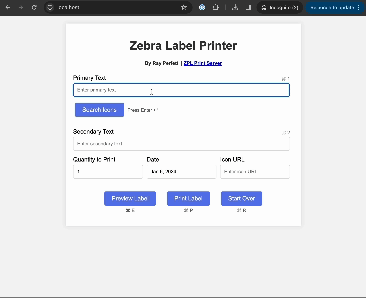

# 2-Click Label Maker

*Dead simple web interface for creating labels with icons on a Zebra printer. Type primary text and press print. Spice things up with an icon added in two clicks. Add details like the date and/or secondary text. Ideal for labeling leftovers or stored food at home (the reason I made this).*

**Supported Functions**:
- Allows primary text, secondary text, a date, and an icon
- Searches for an icon and automatically converts it for Zebra printers
- Previews the label 
- Prints the label 

**Other requirements**
-  A Zebra label printer (generates ZPL language)
-  [ZPL-Rest](https://github.com/mrothenbuecher/zpl-rest) installed and configured

**Installation**
-  Pending instructions

#### Acknowledgements

- Idea for this project: [Uriel Guy](https://github.com/UrielGuy)
- Print server with preview by [mrothenbuecher](https://github.com/mrothenbuecher)
- Image converter by [metafloor](https://github.com/metafloor/zpl-image)
- Icons provided by [IconFinder](https://www.iconfinder.com/)